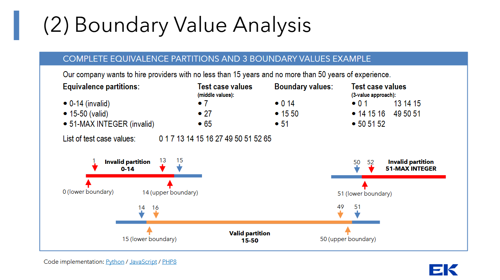
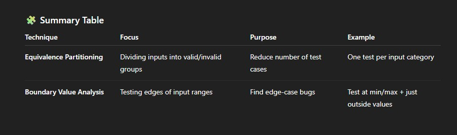

# Blackbox Testing
- Blackbox testing is a software testing method that focuses on examining the functionality of an application without looking at its internal code and structure.

# TL;DR:
- The tester checks what the software does, and not how it does it.

# Advantages
- No need for programming knowledge
- Tests from the users perspective
- Helps identify functional errors, missing features or UI issues

# Disadvantages 
- Limited test coverage (can't see hidden or code errors)
- Can't determine where the bug is in the code
- May miss logical or performance issues in the system

# Common Types of Black-Box Testing:
- Functional Testing (checks features and operations)
- System Testing
- Acceptance Testing
- Regression Testing
- Smoke Testing

# Equivalence partioning
- Group input data into partitions that should behave the same.
- Test only one value from each group.
- Example: If valid ages are 18–65, test one valid value (e.g., 30) and one from each invalid range (e.g., 17, 66).

- Equivalence Partitioning is a black-box test design technique used to reduce the number of test cases by dividing input data into groups (partitions) that are expected to behave the same way.
- In other words — if one value in a partition works, all others in that group should also work.

# Boundary Value Analysis
- Errors often occur at the limits of input ranges.
- Test just below, at, and just above the boundaries.
- Example: For a valid input range 1–100, test 0, 1, 100, and 101.

- Boundary Value Analysis is another black-box technique that focuses on testing the edges (boundaries) of input ranges, since errors often occur at the limits of valid inputs.

- If a range is from 18 to 60, test at:
- The lower boundary and just outside it → 17, 18, 19
- The upper boundary and just outside it → 59, 60, 61

- By combining both you get a complete Boundary Value Analysis

- Both techniques are part of black-box testing because:
- They are based only on the input–output behavior of the system.
- Testers don’t need to know or see the internal code.
- They help design efficient, structured, and focused test cases.

