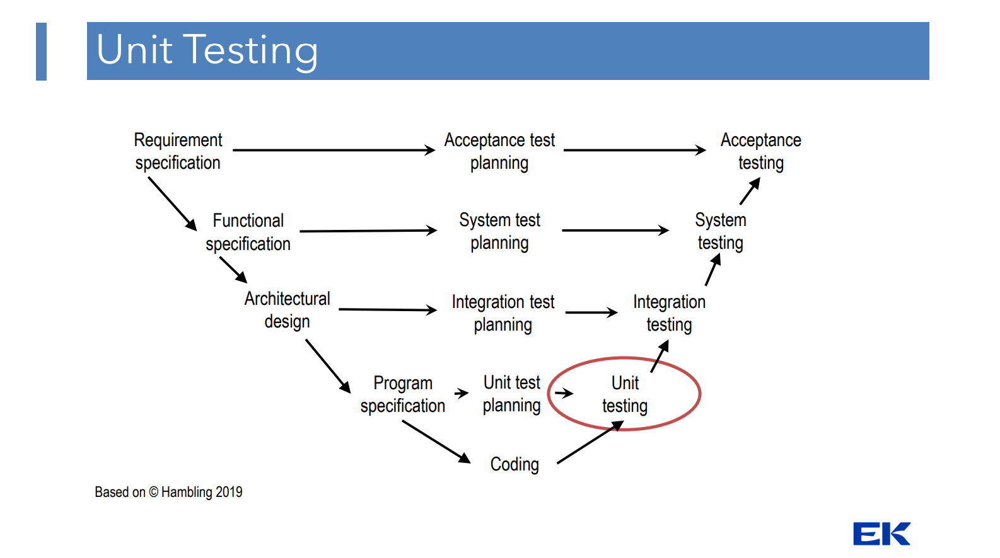

# Introduction to Unit Testing

- Unit testing is a part of the SDLC 

- Testing of a single unit:
    - Usually a function or method
    - You want to test the 'unit' before integrating it with other units/parts of your code that might already be in production.

- Often supported by a unit testing framework like:
    - Vitest
    - cypress
    - Selenium
    - JUnit (Java - Maven)

- Unit Testing allows for regression test automation, cypress is something I have worked with for this. 
    Everytime our developers would work out some new features, we would then test it with our Cypress regression test suite 
    To make sure the new features didn't break our existing code. 

# Unit tests consist of three phases:
• // Arrange - Preconditions to be met before the test starts
• // Act - Execution of the code under test and capture of the outcome
• // Assert - Evaluation of the outcome against the expected result

# Basic assertion methods
• assertEquals Assert that two values are equal
• assertTrue Assert that an expression evaluates to true
• assertFalse Assert that an expression evaluates to false
• assertNull Assert that a value is null
• assertSame Assert that values are equal and point to the same object
• … and many more

# Unit Testing - Best Practices and Anti-patterns
- Each unit test must verify one and only one behavior
- Avoid chaining arrange, act and assert sections
    - as this makes the test harder to read and maintain as it is coupled.
    - The unit test could become an integration test so you want to make it maintainable.

- Avoid branching (if, switch, while, for)
    - The logic should be in the code not in the test.

- Cover the business logic and not much else.
    - Code is always a liability not an asset, therefore we want to keep it as simple as possible (in most cases)
        - The more code you have the higher are the chances of a bug. 

